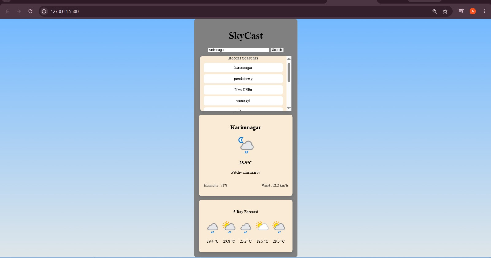

🌤 SkyCast

SkyCast is a simple and responsive weather forecast web application that shows real-time weather conditions and a 5-day forecast for any city. It also keeps track of recent searches for quick access.

🚀 Features
Search weather by city name
Real-time weather updates
5-day weather forecast
Recent search history (click to reuse cities)
Responsive and clean UI
Weather icons based on condition

Preview
🌍 Main Weather View

🎥 Demo

A short demo showing recent searches scrolling through multiple cities:
[Watch Demo](./screenshots/search.mp4)

🛠 Tech Stack
HTML ||
CSS  ||
JavaScript ||
WeatherAPI
